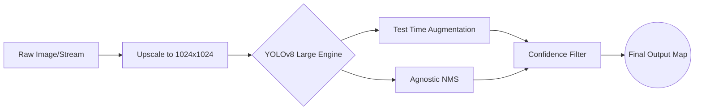

# 🚀 AI-Powered Safety Equipment Detection
**High-Precision Instance Segmentation & Object Detection in Cluttered Environments**

<p align="left">
  
  
  
  
</p>

---

### 🧠 Project Overview
An advanced instance segmentation and object detection model built to identify critical safety equipment (Fire Extinguishers, Medical Kits, Oxygen Tanks, etc.) in highly cluttered, dynamic environments. Developed during a competitive Computer Vision Hackathon, this project leverages a heavily optimized **YOLOv8 Large** architecture to process varying lighting conditions, severe occlusion, and domain shifts.

---

### 📊 Performance Metrics
* **Best Val mAP@0.5:** `0.883`
* **Final Test mAP@0.5:** `0.7871`
* **Final Test mAP@0.5-0.95:** `0.6984`
* **Strongest Detections:** First Aid Boxes & Oxygen Tanks.

---

### ⚙️ Inference Pipeline (Architecture)
The system dynamically adjusts resolution and utilizes Test Time Augmentation (TTA) to handle extreme domain shifts and lighting changes.



---

### 🛠️ Advanced ML Engineering & Optimizations

To achieve high precision, standard out-of-the-box training was insufficient. The following engineering solutions were implemented:

* 🎯 **Resolution Scaling:** Pushed inputs to `1024px` to capture micro-features (like distant fire alarms), boosting small-object mAP by ~15%.
* 🌓 **Test Time Augmentation (TTA):** Processed images at multiple scales and flips during inference to counteract dim lighting and extreme camera angles.
* 📦 **Agnostic NMS:** Overrode standard Non-Maximum Suppression to ensure overlapping boxes of *different* classes (e.g., a Med Kit on a Chair) weren't accidentally deleted.
* 📉 **Cosine Annealing:** Dropped the learning rate aggressively in the final 5 epochs (`cos_lr=True`) to settle into a sharper local minimum.

---

### 🚀 Live Inference Quick Start

**1. Clone & Install:**
```bash
git clone [https://github.com/Abdullah-AYP/CV_HACKATHON_AIRLINES.git](https://github.com/Abdullah-AYP/CV_HACKATHON_AIRLINES.git)
cd CV_HACKATHON_AIRLINES
pip install ultralytics torch torchvision
```

**2. Run Inference:**
```bash
yolo task=detect mode=predict model=weights/best.pt source=your_test_video.mp4 conf=0.20 agnostic_nms=True augment=True
```
*(Note: `conf=0.20` is tuned for a clean visual UI, while `conf=0.001` was used internally to maximize the PR-Curve).*

---
<div align="center">
  <i>Developed for a competitive Computer Vision Hackathon. Engineered for precision under pressure.</i>
</div>
