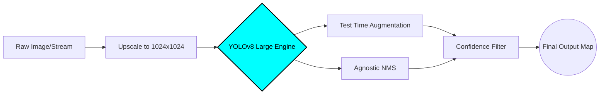

<div align="center">
  
  
  
  # 🚀 AI-Powered Safety Equipment Detection
  **High-Precision Instance Segmentation & Object Detection in Cluttered Environments**

  <p>
    
    
    
  </p>
</div>

---

### 👁️ Visual Results & Detections

| Environment | Model Detection Confidence |
| :---: | :---: |
|  |  |
| *Heavy Occlusion (First Aid Box)* | *High Confidence Detection (0.8+)* |
|  |  |
| *Complex Angles (Oxygen Tanks)* | *Precision Bonding Boxes* |

---

### 🧠 Inference Pipeline (How it Works)
The system doesn't just pass images to a model. It dynamically adjusts resolution and utilizes Test Time Augmentation (TTA) to handle extreme domain shifts and lighting changes.



---

### 📊 Performance Metrics & Engineering

Standard out-of-the-box training failed on small objects like distant fire alarms. To hit our **`0.7871` Test mAP@0.5**, we engineered the following solutions:

* 🎯 **Resolution Scaling:** Pushed inputs to `1024px` to capture micro-features, boosting small-object mAP by ~15%.
* 🌓 **Test Time Augmentation (TTA):** Processed images at multiple scales and flips during inference to counteract dim cabin lighting and weird camera angles.
* 📦 **Agnostic NMS:** Overrode standard suppression to ensure overlapping boxes of *different* classes (e.g., a Med Kit on a Chair) weren't accidentally deleted.
* 📉 **Cosine Annealing:** Dropped the learning rate aggressively in the final 5 epochs (`cos_lr=True`) to settle into a sharper local minimum.

---

### 🚀 Live Inference Quick Start

**1. Clone & Install:**
```bash
git clone [https://github.com/Abdullah-AYP/CV_HACKATHON_AIRLINES.git](https://github.com/Abdullah-AYP/CV_HACKATHON_AIRLINES.git)
cd CV_HACKATHON_AIRLINES
pip install ultralytics torch torchvision
```

**2. Run the Visualizer (Live Demo):**
```bash
yolo task=detect mode=predict model=weights/best.pt source=your_test_video.mp4 conf=0.20 agnostic_nms=True augment=True
```
*(Note: `conf=0.20` is tuned for a clean visual UI, while `conf=0.001` was used internally to maximize the PR-Curve).*

---
<div align="center">
  <i>Developed for a competitive Computer Vision Hackathon. Engineered for precision under pressure.</i>
</div>
